# containers07

IWNO7: Создание много контейнерного приложения

## Цель работы

Ознакомиться с работой многоконтейнерного приложения на базе docker-compose.

## Задание

Создать PHP-приложение на базе трех контейнеров: `nginx`, `php-fpm`, `mariadb`, используя `docker-compose`.

## Подготовка

Для выполнения работы необходим установленный Docker. Работа основана на лабораторной работе №5.

## Выполнение

### 1. Создание репозитория

Создан репозиторий containers07 и склонирован на локальный компьютер:

```bash
git clone https://github.com/zabudico/containers07.git
cd containers07
```

### 2. Сайт на PHP

Создана директория mounts/site:

```bash
mkdir -p mounts/site
```

В директорию mounts/site скопирован PHP-сайт из предыдущей лабораторной работы, включающий:

`index.php` — главная страница приложения.
`src/config/database.php` — файл настройки подключения к базе данных:

```php

<?php
session_start();

$host = 'database';
$dbname = 'task_manager';
$username = 'user';
$password = 'secret';

try {
    // Подключаемся без базы для создания
    $pdo = new PDO("mysql:host=$host;charset=utf8mb4", $username, $password);
    $pdo->setAttribute(PDO::ATTR_ERRMODE, PDO::ERRMODE_EXCEPTION);

    // Создаем базу, если не существует
    $pdo->exec("CREATE DATABASE IF NOT EXISTS $dbname");

    // Подключаемся к базе
    $pdo = new PDO("mysql:host=$host;dbname=$dbname;charset=utf8mb4", $username, $password);
    $pdo->setAttribute(PDO::ATTR_ERRMODE, PDO::ERRMODE_EXCEPTION);

    // Создаем таблицу tasks
    $pdo->exec("
        CREATE TABLE IF NOT EXISTS tasks (
            id INT AUTO_INCREMENT PRIMARY KEY,
            title VARCHAR(255) NOT NULL,
            description TEXT,
            created_at TIMESTAMP DEFAULT CURRENT_TIMESTAMP
        )
    ");
} catch (PDOException $e) {
    die("Ошибка подключения к базе данных: " . $e->getMessage());
}

// CSRF-токен
if (!isset($_SESSION['csrf_token'])) {
    $_SESSION['csrf_token'] = bin2hex(random_bytes(32));
}
?>

```

### 3. Конфигурационные файлы

Создан файл `.gitignore` в корне проекта:

```bash
# Ignore files and directories
mounts/site/*
```

Создан файл `nginx/default.conf`:

```bash

server {
    listen 80;
    server_name _;
    root /var/www/html/public;
    index index.php;

    location / {
        try_files $uri $uri/ /index.php?$args;
    }

    location ~ \.php$ {
        fastcgi_pass backend:9000;
        fastcgi_index index.php;
        fastcgi_param SCRIPT_FILENAME $document_root$fastcgi_script_name;
        include fastcgi_params;
    }
}
```

Создан файл `docker-compose.yml`:

```bash

version: '3.9'

services:
  database:
    image: mysql:8.0
    env_file:
      - mysql.env
    networks:
      - internal
    volumes:
      - db_data:/var/lib/mysql
      - ./mounts/init.sql:/docker-entrypoint-initdb.d/init.sql
  frontend:
    image: nginx:1.19
    volumes:
      - ./mounts/site:/var/www/html
      - ./nginx/default.conf:/etc/nginx/conf.d/default.conf
    ports:
      - "8080:80"
    networks:
      - internal
  backend:
    build:
      context: .
      dockerfile: Dockerfile
    volumes:
      - ./mounts/site:/var/www/html
    networks:
      - internal
    env_file:
      - mysql.env

networks:
  internal: {}

volumes:
  db_data: {}
```

Создан файл `Dockerfile` для сервиса backend:

```bash
FROM php:7.4-fpm

# Установка драйвера PDO MySQL
RUN docker-php-ext-install pdo_mysql
```

Создан файл `mysql.env`:

```bash
MYSQL_ROOT_PASSWORD=secret
MYSQL_DATABASE=task_manager
MYSQL_USER=user
MYSQL_PASSWORD=secret
```

Создан файл `mounts/init.sql` для автоматической инициализации базы данных:

```sql
CREATE DATABASE IF NOT EXISTS task_manager;
CREATE USER IF NOT EXISTS 'user'@'%' IDENTIFIED BY 'secret';
GRANT ALL PRIVILEGES ON task_manager.* TO 'user'@'%';
FLUSH PRIVILEGES;
USE task_manager;
CREATE TABLE IF NOT EXISTS tasks (
    id INT AUTO_INCREMENT PRIMARY KEY,
    title VARCHAR(255) NOT NULL,
    description TEXT,
    created_at TIMESTAMP DEFAULT CURRENT_TIMESTAMP
);
```

### 4. Запуск и тестирование

Запущены контейнеры:

```bash
cd containers07
docker-compose up -d
```

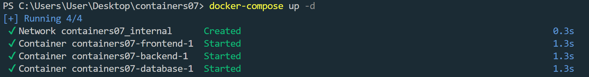

Проверена работа сайта по адресу http://localhost:8080/. Страница отобразилась корректно после перезагрузки.

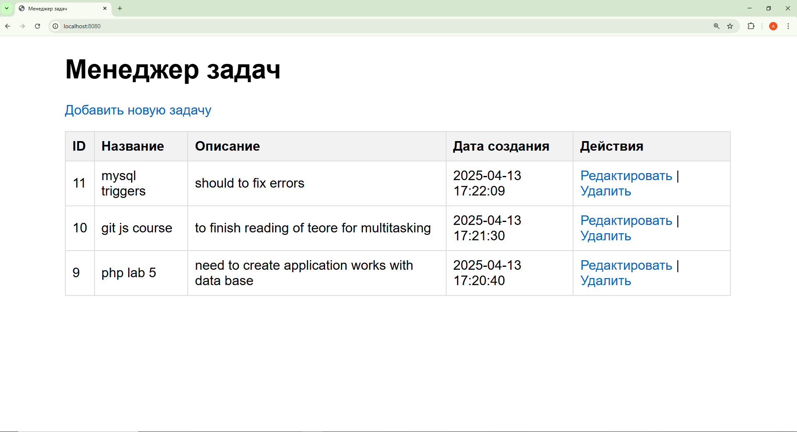

Выполнена проверка подключения к базе данных:

```bash
docker exec -it containers06-backend-1 bash
apt-get update && apt-get install -y default-mysql-client
mysql -h database -u user -p
```

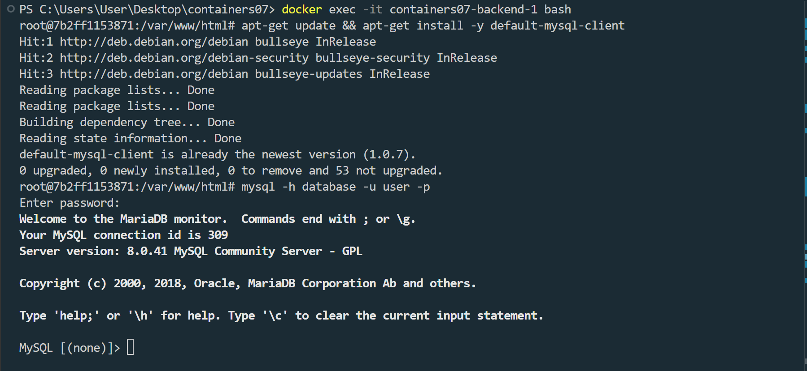

```sql
USE task_manager;
SHOW TABLES;
```

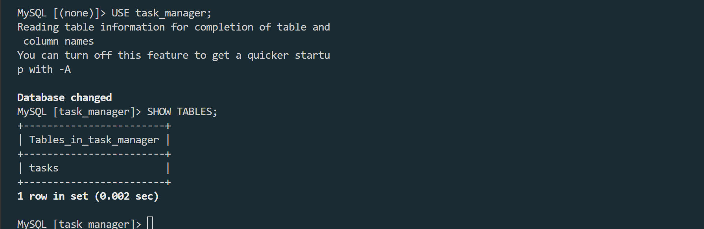

```sql
SELECT * FROM tasks;
```

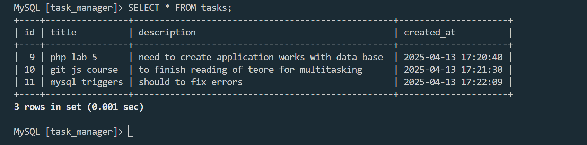

### 5. Устранение проблем

В процессе выполнения возникли следующие ошибки и были решены:

- Ошибка `SQLSTATE[HY000] [1044] Access denied for user 'user'@'%' to database 'task_manager'`:
  Причина: Пользователь 'user'@'%' не имел привилегий на базу task_manager.
  Решение: Удален пользователь и создан заново с правильными привилегиями:

```sql
DROP USER IF EXISTS 'user'@'%';
CREATE USER 'user'@'%' IDENTIFIED BY 'secret';
GRANT ALL PRIVILEGES ON task_manager.* TO 'user'@'%';
FLUSH PRIVILEGES;
```

- Ошибка `SQLSTATE[HY000] [1049] Unknown database 'task_manager'`:
  Причина: База `task_manager` отсутствовала после перезапуска контейнеров.
  Решение: Добавлен файл `init.sql` для автоматического создания базы и таблицы.

Ошибка `ERROR 1045 (28000): Access denied for user 'root'@'localhost'`:
Причина: Неверный пароль для 'root'@'localhost'.
Решение: Сброс пароля в безопасном режиме:

```bash
docker run --rm -d --name temp-mysql -v containers07_db_data:/var/lib/mysql mysql:8.0 --skip-grant-tables
docker exec -it temp-mysql mysql -u root
```

```sql
USE mysql;
ALTER USER 'root'@'localhost' IDENTIFIED BY 'root';
FLUSH PRIVILEGES;
```

### Проверка работоспособности сайта

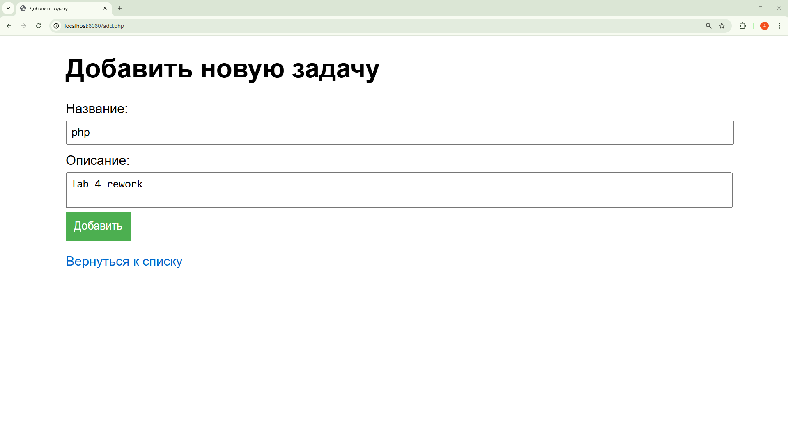

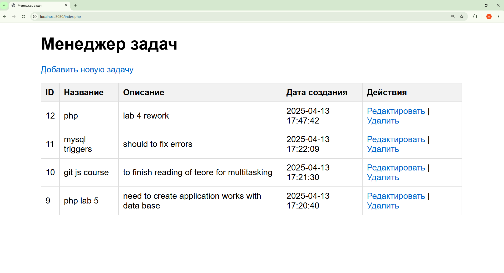

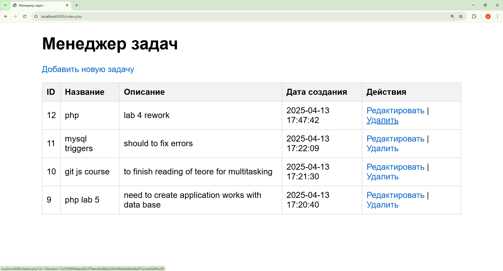

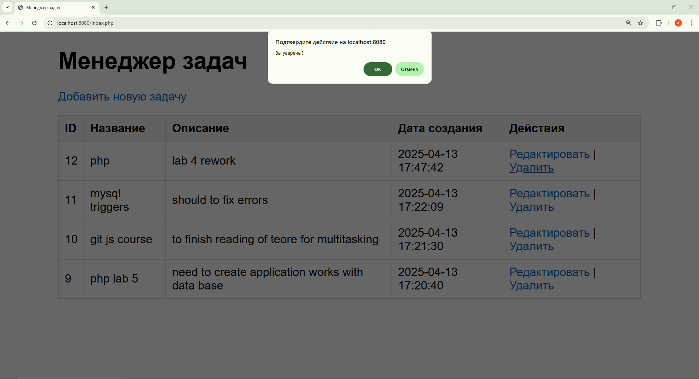

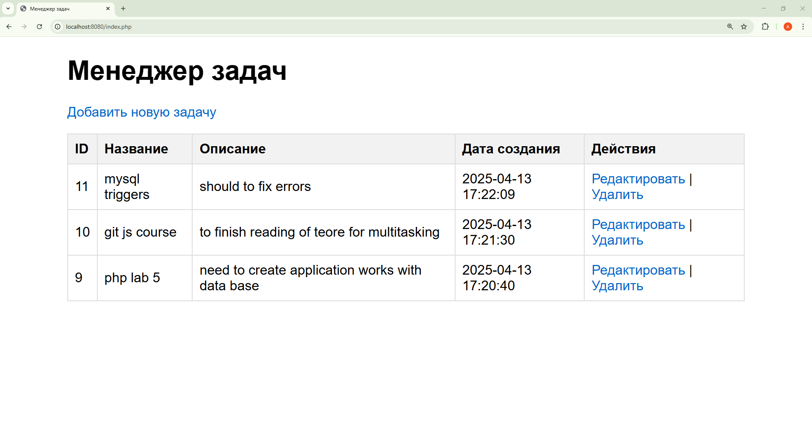

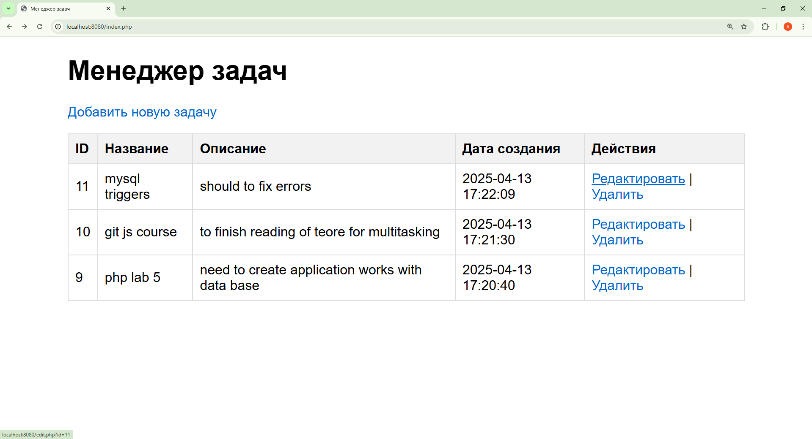

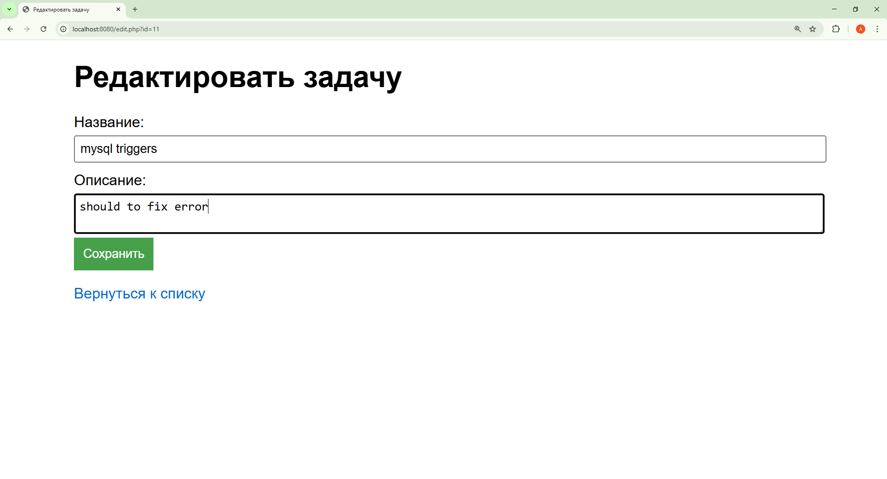

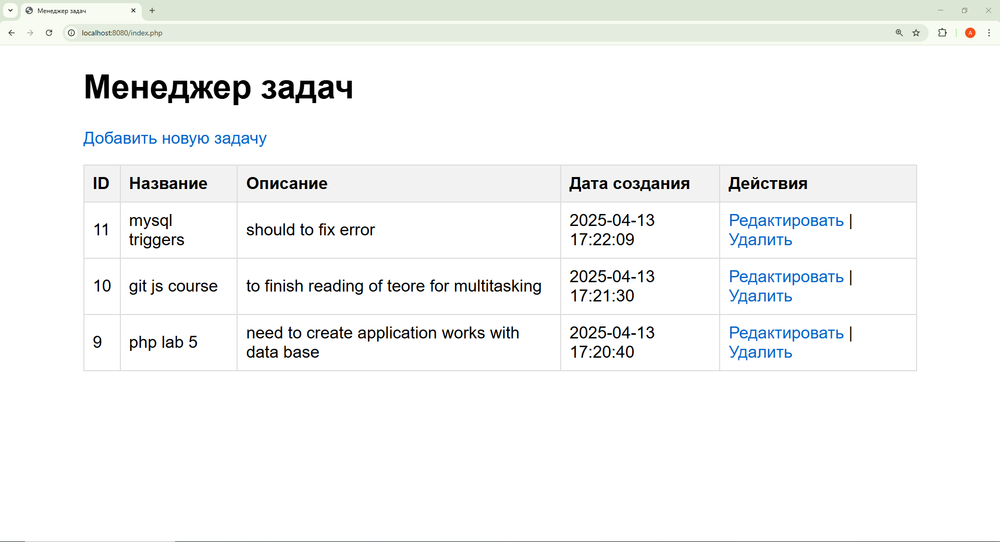

### 6. Ответы на вопросы

1.  В каком порядке запускаются контейнеры?

    - Контейнеры запускаются в порядке, определенном зависимостями в docker-compose.yml. В данном случае:

    - Сначала запускается database, так как backend косвенно зависит от него через переменные окружения в mysql.env.
    - Затем backend и frontend, так как они используют сеть internal и тома, но явных зависимостей (depends_on) нет.
    - Порядок не строго фиксирован, но Docker Compose старается запускать сервисы параллельно, если не указано иное.

2.  Где хранятся данные базы данных?

    - Данные базы данных хранятся в Docker-томе `db_data`, который смонтирован в `/var/lib/mysql` контейнера `database`:

    ```yaml
    volumes:
      - db_data:/var/lib/mysql
    ```

    - Физически том находится в хранилище Docker (на Windows обычно в `C:\Users\<User>\AppData\Local\Docker\wsl\data).`

3.  Как называются контейнеры проекта?

    Контейнеры автоматически именуются по шаблону `<project_name>_<service_name>_1`. Для проекта containers07:

        `containers07-database-1`
        `containers07-backend-1`
        `containers07-frontend-1`

4.  Как добавить файл `app.env` с переменной `APP_VERSION` для `backend` и `frontend`?

    - Создать файл `app.env` в корне проекта:

    ```text
    APP_VERSION=1.0.0
    ```

    - Обновить `docker-compose.yml`, добавив `env_file` для сервисов `backend` и `frontend`:

```yaml

services:

database:
image: mysql:8.0
env_file: - mysql.env
networks: - internal
volumes: - db_data:/var/lib/mysql - ./mounts/init.sql:/docker-entrypoint-initdb.d/init.sql

frontend:
image: nginx:1.19
volumes: - ./mounts/site:/var/www/html - ./nginx/default.conf:/etc/nginx/conf.d/default.conf
ports: - "8080:80"
networks: - internal
env_file: - app.env

backend:
build:
context: .
dockerfile: Dockerfile
volumes: - ./mounts/site:/var/www/html
networks: - internal
env_file: - mysql.env - app.env
networks:
internal: {}
volumes:
db_data: {}

```

    - Перезапустить контейнеры:

    ```bash
    docker-compose down
    docker-compose up -d
    ```

    - Переменная `APP_VERSION` будет доступна в контейнерах `backend` и `frontend`.

### 7. Выводы

В ходе лабораторной работы было создано многоконтейнерное PHP-приложение с использованием docker-compose. Настроены три сервиса: `nginx (frontend)`, `php-fpm (backend)` и `mysql (database)`. Решены проблемы с подключением к базе данных, включая ошибки `[1044]`, `[1049]` и `[1045]`. Добавлен файл `init.sql` для автоматической инициализации базы, что повысило стабильность приложения. Изучены основы работы с Docker-томами, сетями и переменными окружения. Работа с `docker-compose` позволила понять порядок запуска контейнеров и управление зависимостями.

### 8. Библиография

1. Docker Documentation. Official Docker Documentation. URL: https://docs.docker.com/
2. Docker Compose Documentation. Docker Compose Reference. URL: https://docs.docker.com/compose/
3. MySQL Documentation. Official MySQL 8.0 Reference Manual. URL: https://dev.mysql.com/doc/refman/8.0/en/
